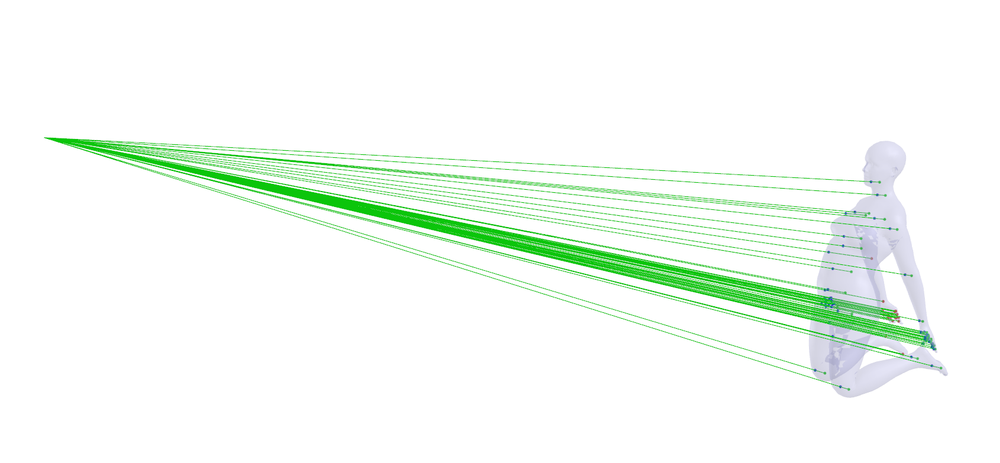
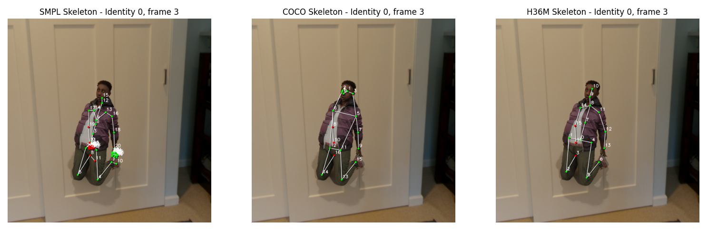

# SynthBody Extra Annotations

This repository contains the code to generate extra annotations for the [SynthBody dataset](https://github.com/microsoft/SynthMoCap). In particular, we generate the 2D and 3D joints positions for the SMPL, COCO and H3.6M skeletons formats along with a visibility flag for each joint.

## Download the extra annotations

The extra annotations are available for download [here]().

## Generate the extra annotations

1. Start by downloading the SynthBody dataset from the [SynthMoCap repository](https://github.com/microsoft/SynthMoCap/blob/main/DATASETS.md).

2. Clone this repository:
```sh
git clone https://github.com/cjaverliat/synthbody-extra-annotations.git
cd synthbody-extra-annotations
```

3. Install the required dependencies in a virtual environment:
```sh
python -m venv .venv
source .venv/bin/activate
pip install -r requirements.txt
```

4. Generate the extra annotations for the SynthBody dataset using the following command:
```sh
python generate.py path/to/SynthMoCap/synth_body/ --smplh_model path/to/smplh/model_neutral.npz --output_dir ./output/extra_annotations/ --skeleton_type coco --visibility_threshold 0.3 --n_workers 8
```
The file 'annotations_<skeleton_type>.npy' will be saved in the output directory.
The generated annotations are saved in the following format:
```python
{
    "skeleton_type": str, # 'coco', 'h36m' or 'smpl',
    "visibility_threshold": float, # visibility threshold used to generate the visibility flag for each joint
    "instances": [
        {
            'image': str, # image filename
            'identity': int,
            'frame': int,
            'bbox': np.array([4]), # [x, y, w, h]
            'joints_3d': np.array([n_joints, 3]), # 3D joints positions in the format specified by 'skeleton_type' (eg. coco is 17 joints)
            'joints_2d': np.array([n_joints, 2]), # 2D joints positions in the format specified by 'skeleton_type' (eg. coco is 17 joints)
            'joints_vis': np.array([n_joints]), # visibility flag for each joint
            'camera_w2c': np.array([4, 4]), # camera world to camera matrix
            'camera_K': np.array([3, 3]), # camera intrinsic matrix
            'camera_resolution': np.array([2]), # [width, height]
        },
        {
            ...
        }
    ]
}
```

## Preview the generated extra annotations

You can preview the generated extra annotations using the following command:
```sh
python generate.py path/to/SynthMoCap/synth_body/ --smplh_model path/to/smplh/model_neutral.npz --skeleton_type coco --visibility_threshold 0.3 --preview_2d --preview_3d
```
This will display a 3D scene with the raycast used to generate the visibility flag for each joint and a 2D preview of the SMPL, COCO and H3.6M skeletons. The visible joints are colored in green and the occluded joints are colored in red.


